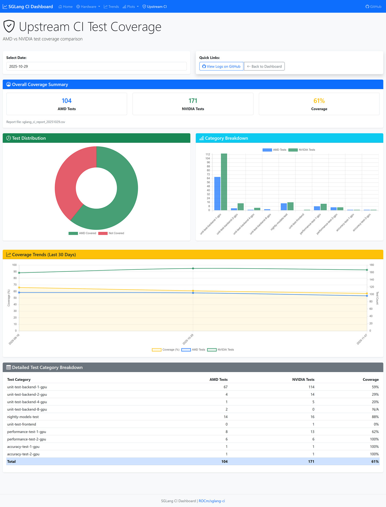
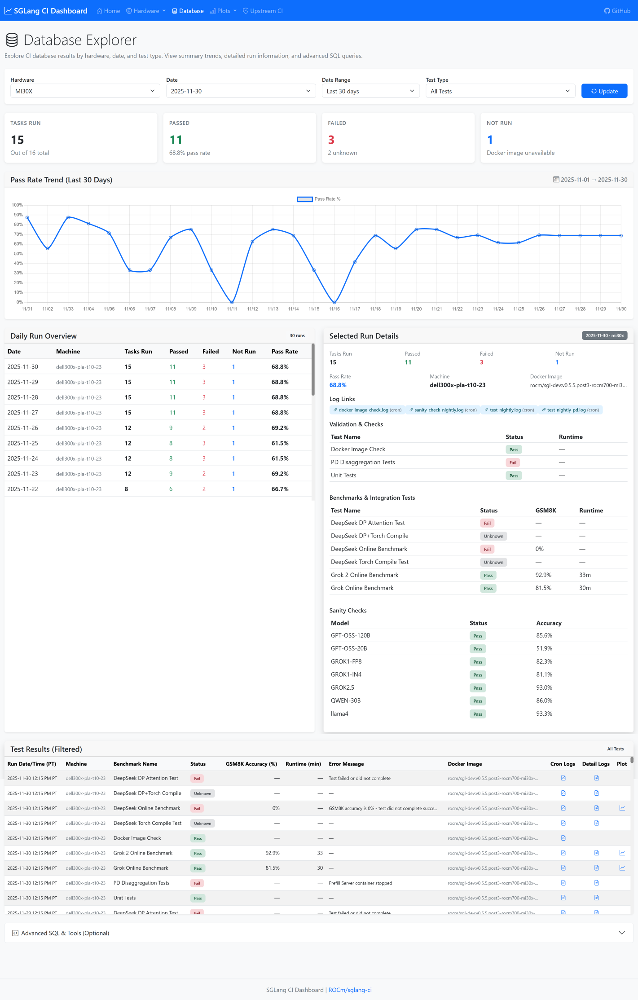

# SGLang CI, Dashboard and Toolkit

SGLang ([github.com/sgl-project/sglang](https://github.com/sgl-project/sglang)) is an open-source serving engine for large language models.
This repository provides a comprehensive benchmarking and continuous integration toolkit for SGLang on AMD MI30X/MI35X hardware. The toolkit combines automated benchmark execution with a web dashboard and database backend for performance analysis, trend tracking, and Teams-integrated alerting.

## Key Features

- **Wide Test Coverage:** Validation & checks (unit tests, PD disaggregation, Docker image), performance benchmarks (DeepSeek/Grok online), integration tests (DP attention, MTP, torch compile), and per-model sanity checks across MI30X and MI35X hardware.
- **Extensive Model Support:** DeepSeek, Grok, GPT, Qwen, Llama and more with ready-to-run presets and quantization options (FP8/INT8/INT4/MXFP4).
- **Dashboard & Database:** Centralized web dashboard for CI results, performance plots, and hardware comparisons; SQLite backend with 50-300x faster queries and automatic GitHub sync.
- **Benchmarking & Analytics:** Offline and online serving benchmarks capturing latency (prefill/decode, TTFT, ITL), throughput, and GSM8K accuracy with automated trend analysis and interactive plots.
- **Production-Ready Automation:** Docker-based workflows, scheduled nightly jobs, intelligent GPU resource checks, Teams alerts (accuracy monitoring, regression detection, daily summaries), and flexible CLI configuration with automatic backend selection (aiter/triton).
- **Upstream SGLang CI Toolkit:** AMD vs NVIDIA test coverage analysis, benchmark CSV comparison, and on-demand upstream test execution.

---

## Table of Contents

- [Interactive Dashboard](#-interactive-dashboard)
- [Database System](#️-database-system)
- [Supported Docker Images](#supported-docker-images)
- [Benchmark CI](#benchmark-ci)
  - [Offline Mode](#offline-mode)
  - [Online Mode](#online-mode)
  - [Data Processing and Visualization](#data-processing-and-visualization)
- [Nightly CI](#nightly-ci)
  - [Nightly Docker Image Monitoring](#nightly-docker-image-monitoring)
  - [Nightly Unit Test](#nightly-unit-test)
  - [Nightly PD (Prefill-Decode Disaggregation) Test](#nightly-pd-prefill-decode-disaggregation-test)
  - [Nightly Sanity Check](#nightly-sanity-check)
  - [Nightly Benchmarking](#nightly-benchmarking)
- [Teams Integration](#teams-integration)
- [Upstream SGLang Tool](#upstream-sglang-tool)
  - [Compare CI Suites](#compare-ci-suites)
  - [Run AMD upstream tests](#run-amd-upstream-tests)
  - [Benchmark Comparison](#benchmark-comparison)
- [Utility Scripts](#utility-scripts)
  - [Model Download](#model-download)
  - [Docker Image Management](#docker-image-management)
  - [Dashboard Management](#dashboard-management)
  - [System Maintenance](#system-maintenance)
  - [Database Management](#database-management)
- [Requirements](#requirements)
- [Additional Notes](#additional-notes)
- [Cron Schedule](#cron-schedule)
- [Contribution Guide](#contribution-guide)

---

## 📊 Interactive Dashboard

**Access:** http://10.194.129.138:5000 (Internal Network Only)

### Dashboard Features

- **📈 Daily Summaries**: Real-time status for MI30X and MI35X platforms with pass/fail statistics
- **📉 Historical Trends**: Pass rates, GSM8K accuracy trends, runtime analytics via Database Explorer
- **📊 Performance Plots**: Interactive visualization of benchmark results with GitHub links
- **🔍 Task Details**: Detailed status for each CI task (benchmarks, integration tests, validation)
- **⚖️ Hardware Comparison**: Side-by-side comparison charts for MI30X vs MI35X platforms
- **🧪 Upstream CI Coverage**: AMD vs NVIDIA test coverage tracking with interactive charts
- **📅 Date Selector**: Browse historical results with smart calendar

### Dashboard Pages

| Page | URL | Description |
|------|-----|-------------|
| **Home** | http://10.194.129.138:5000/ | Overview with summary cards for both platforms |
| **MI30X Dashboard** | http://10.194.129.138:5000/hardware/mi30x | Detailed MI30X results and task breakdown |
| **MI35X Dashboard** | http://10.194.129.138:5000/hardware/mi35x | Detailed MI35X results and task breakdown |
| **Plots** | http://10.194.129.138:5000/plots/mi30x | Performance plots gallery |
| **Upstream CI** | http://10.194.129.138:5000/upstream-ci | AMD vs NVIDIA coverage comparison |
| **Database Explorer** | http://10.194.129.138:5000/database | SQL queries, historical trends, and raw data access |

### Dashboard Pages Preview

#### 1. Home Page
**URL:** http://10.194.129.138:5000/

Overview dashboard showing:
- Summary cards for MI30X and MI35X platforms
- Pass/fail statistics and pass rate percentages
- Hardware comparison chart (bar chart)
- Recent activity table (last 7 days across both platforms)
- Date selector with smart calendar


#### 2. Hardware Dashboard (MI30X/MI35X)
**URL:** http://10.194.129.138:5000/hardware/mi35x

Detailed results showing:
- Overall summary with pass rate progress bar
- **Performance Benchmarks:** Grok, Grok 2, and DeepSeek online benchmarks with GSM8K accuracy
- **Integration Tests:** DP attention, torch compile, and combined tests
- **Validation & Checks:** Unit tests, PD disaggregation tests, Docker image checks
- **Sanity Check:** Per-model GSM8K accuracy with pass/fail status


#### 3. Plots Viewer
**URL:** http://10.194.129.138:5000/plots/mi30x

Performance plot gallery with:
- Benchmark plots for each model (Grok, Grok 2, DeepSeek)
- Direct links to GitHub for full resolution
- Download options for all plots
- Date selector to view historical plots


#### 4. Upstream CI Coverage
**URL:** http://10.194.129.138:5000/upstream-ci

AMD vs NVIDIA test coverage tracking with:
- Overall coverage summary (total tests and percentages)
- Test category breakdown by GPU count
- Interactive charts: doughnut (coverage distribution), bar (category comparison), line (30-day trends)
- Detailed test category table
- Date selector to view historical reports



#### 5. Database Explorer
**URL:** http://10.194.129.138:5000/database

Powerful database interface for querying and analyzing CI data:
- **Overview Panel**: Daily run summaries with pass/fail statistics and benchmark results
- **SQL Query Editor**: Execute custom SELECT queries against the SQLite database
- **Schema Browser**: View all tables and column definitions
- **Date Range Filters**: Analyze data across configurable time periods
- **Export Support**: Download query results for further analysis



**Full Documentation:** See `dashboard/README.md` for detailed dashboard documentation including API endpoints, deployment options, and troubleshooting.

---

## 🗄️ Database System

The dashboard uses an SQLite database for fast queries and efficient data access. The database is automatically synced to GitHub for cross-machine sharing.

**Database Location:** `database/ci_dashboard.db`

### Quick Start

```bash
# Pull existing database from GitHub
python database/sync_database.py pull

# Or create from logs (backfill last 30 days)
python database/ingest_data.py --backfill 30

# Start dashboard with database (enabled by default)
bash dashboard/start_dashboard.sh
```

### Key Features

- **Fast Queries:** 50-300x faster than filesystem parsing
- **GitHub Sync:** Automatic backup and cross-machine sharing
- **Historical Trends:** Efficient querying for long-term analytics
- **Automatic Updates:** Cron-based ingestion after CI runs

### Database Schema

**Main Tables:**
- `test_runs` - Daily CI run tracking (date, hardware, status, pass/fail counts)
- `benchmark_results` - Performance benchmarks (GSM8K accuracy, runtime)
- `sanity_check_results` - Per-model sanity check results
- `log_files` - Log file links (local paths and GitHub URLs)
- `plot_files` - Plot image links (local paths and GitHub URLs)

### Daily Workflow

**Automated (via Cron):**
1. Nightly CI tests run (7:00 AM)
2. Database ingestion (`update_dashboard_database.sh`)
3. GitHub sync (automatic)

**Manual Operations:**
```bash
# Ingest today's data
python database/ingest_data.py

# Ingest specific date
python database/ingest_data.py --date 20251114

# Sync with GitHub
python database/sync_database.py pull  # Download latest
python database/sync_database.py push  # Upload local changes
```

### Performance Comparison

| Operation | Filesystem | Database | Speedup |
|-----------|-----------|----------|---------|
| Daily summary | 1-2s | 10-20ms | 50-100x |
| 30-day trends | 30-60s | 100-200ms | 150-300x |

**Full Documentation:** See `database/README.md` and `database/QUICKSTART.md` for complete schema details, Python API, and troubleshooting.

---

## Supported Docker Images

The benchmark scripts support Docker images from multiple sources:

1. **ROCm SGLang Development Images:** Available at <https://hub.docker.com/r/rocm/sgl-dev>
   - Example: `rocm/sgl-dev:v0.4.9.post2-rocm630-mi30x-20250716` (nightly build)

2. **LMSYS SGLang Images:** Available at <https://hub.docker.com/r/lmsysorg/sglang/tags>
   - Example: `lmsysorg/sglang:v0.4.9.post2-rocm630-mi30x`

3. **Pre-built Images via Helper Script:**
   **Recommended approach:** Use the provided helper script to pull pre-built SGLang images from DockerHub:

   ```bash
   # Pull latest image (main branch)
   bash upstream_ci/build_sglang_docker.sh

   # Pull specific version
   bash upstream_ci/build_sglang_docker.sh --branch=v0.4.9
   ```

   **Important Limitations:**
   - This approach pulls pre-built images and will **NOT work for PRs that change aiter version**
   - Pre-built images are based on main/released versions, not specific PR changes
   - This is a workaround until aiter build becomes faster in the future

   **Manual Build Alternative:**
   If you need to build from source (e.g., for PRs with version changes), please refer to the official SGLang repository for the latest build instructions:

   **📋 Latest Build Instructions:** <https://github.com/sgl-project/sglang/blob/main/docker/Dockerfile.rocm>

   **Note:** When building from source in the future, remember to rebuild sgl_kernel inside the Docker image after PR checkout.

**Important:** You must provide the full Docker image name including the registry/organization prefix.

---

## Benchmark CI

### Offline Mode

Offline mode benchmarks are executed without real-time interaction, measuring model performance through batch processing. The following scripts are available for offline benchmarking:

#### grok_perf_offline_csv.sh

**Purpose:** Benchmarks GROK models (GROK1/GROK2) in offline batch mode.

**Key Parameters:** `--docker_image`, `--mode` (normal/long_context/dummy), `--model`, `--model-type` (grok1/grok2), `--tokenizer`

**Modes:** Normal (TP=8, batch 1-256, IL=1024, OL=128), Long Context (IL=8K/16K/32K, OL=10), Dummy (IL=256, OL=4096)

**Metrics:** Prefill/decode/E2E latency and throughput

**Output:** Date-stamped folder with CSV results, config.json

**Usage:**

```bash
# Basic usage
bash scripts/grok_perf_offline_csv.sh

# Grok 2 with long context
bash scripts/grok_perf_offline_csv.sh --model-type=grok2 --mode=long_context
```

#### deepseek_perf_offline_csv.sh

**Purpose:** Benchmarks DeepSeek models with FP8 quantization and GSM8K warm-up validation.

**Key Parameters:** `--docker_image`, `--model`, `--model-name`, `--threshold` (GSM8K, default: 0.93), `--download-model`

**Configuration:** TP=8, batch=32, IL=128, OL=32

**Metrics:** Prefill/decode/E2E latency and throughput, GSM8K accuracy

**Output:** Date-stamped folder with CSV results and GSM8K logs

**Usage:**

```bash
# Basic usage
bash scripts/deepseek_perf_offline_csv.sh

# Custom model with download
bash scripts/deepseek_perf_offline_csv.sh --model=$MODEL_PATH --download-model
```

### Online Mode

Online mode benchmarks measure the real-time serving performance of GROK models (GROK1, GROK2). This mode is designed to simulate interactive use and assess latency under different request rates.

#### grok_perf_online_csv.sh

**Purpose:** Benchmarks GROK models (GROK1/GROK2) online serving performance with GSM8K warm-up validation.

**Key Parameters:** `--docker_image`, `--model`, `--model-type` (grok1/grok2), `--threshold` (GSM8K, default: 0.8)

**Workflow:** GSM8K validation → Server launch (aiter backend) → Multi-rate client benchmarks → CSV aggregation

**Metrics:** E2E latency, TTFT, ITL across multiple request rates

**Output:** Date-stamped folder with server/client logs and CSV summary

**Usage:**

```bash
# Basic usage (GROK1)
bash scripts/grok_perf_online_csv.sh

# GROK2 model
bash scripts/grok_perf_online_csv.sh --model-type=grok2 --threshold=0.85
```

#### deepseek_perf_online_csv.sh

**Purpose:** Benchmarks DeepSeek models online serving performance with GSM8K validation and multiple test modes.

**Key Parameters:**
- `--docker_image`, `--model`, `--model-name`, `--threshold` (GSM8K, default: 0.93), `--download-model`
- **Test Modes:**
  - `--check-dp-attention`: DP attention validation (GSM8K only)
  - `--enable-torch-compile`: Torch compile optimization (GSM8K only)
  - `--enable-mtp-test`: MTP throughput export (GSM8K + serving)
  - `--enable-dp-test`: DP attention + serving benchmarks
**Workflow:** GSM8K validation → Server launch (TP=8, mode-specific config) → Multi-concurrency serving benchmarks (128/64/16/4/1)

**Metrics:** GSM8K accuracy, E2E latency, TTFT, ITL across concurrency levels

**Output:** Date-stamped folder with mode suffix, server/client logs, CSV results, optional MTP plots

**Usage:**

```bash
# Basic usage
bash scripts/deepseek_perf_online_csv.sh

# DP attention validation (GSM8K only)
bash scripts/deepseek_perf_online_csv.sh --check-dp-attention

# Torch compile optimization (GSM8K only)
bash scripts/deepseek_perf_online_csv.sh --enable-torch-compile

# MTP throughput export (GSM8K + serving)
bash scripts/deepseek_perf_online_csv.sh --enable-mtp-test --hardware=mi35x

# DP test with serving benchmarks
bash scripts/deepseek_perf_online_csv.sh --enable-dp-test
```

### Data Processing and Visualization

#### Processing and Plotting Scripts

**`process_and_generate_offline_plots.py`** - Consolidates offline benchmark data from multiple dates and generates latency/throughput trend plots.

**`process_and_generate_online_plots.py`** - Consolidates online benchmark data and generates E2E/TTFT/ITL trend plots with model-specific load metrics.

**Usage:**

```bash
# Offline plots
python3 scripts/process_and_generate_offline_plots.py --model grok|deepseek

# Online plots
python3 scripts/process_and_generate_online_plots.py --model grok|deepseek
```

---

## Nightly CI

This section covers all automated nightly continuous integration processes, including benchmarking, unit testing, and Docker image monitoring.

### Nightly Docker Image Monitoring

#### nightly_image_check.sh

Checks `rocm/sgl-dev` nightly images for mi30x/mi35x via Docker Hub API with optional Teams alerts.

**Usage:**

```bash
bash scripts/nightly_image_check.sh --teams-webhook="https://your-webhook-url"
```

### Nightly Unit Test

#### test_nightly.sh

Automated test runner for unit tests (`test_custom_allreduce`) or PD disaggregation tests on latest Docker images with GPU resource management and Teams alerts.

**Parameters:** `--hardware` (mi30x/mi35x), `--test-type` (unit/pd), `--model-path`, `--image-date`, `--teams-webhook-url`

**Usage:**

```bash
# Unit test (default mi30x)
bash test/test_nightly.sh --hardware=mi35x --teams-webhook-url="https://your-webhook-url"

# PD test
bash test/test_nightly.sh --test-type=pd --hardware=mi35x
```

**Output:** `test/unit-test-backend-8-gpu-CAR-amd/{docker_tag}.log` for unit tests, `test/pd/pd_log/{hardware}/{docker_tag}/` for PD tests

### Nightly PD (Prefill-Decode Disaggregation) Test

Validates PD disaggregation with 3-container architecture: Router (port 30028) → Prefill (port 30025, GPUs 0-3, TP=4) → Decode (port 30026, GPUs 4-7, TP=4).

**Default Models:** mi30x (DeepSeek-V3-0324), mi35x (DeepSeek-R1-MXFP4-Preview)

**Tests:** Health check, model info, completions, code generation, GSM8K (200 questions)

**Usage:**

```bash
bash test/test_nightly.sh --test-type=pd --hardware=mi35x
```

**Output:** `test/pd/pd_log/{hardware}/{docker_tag}/` with test_summary.txt, container logs, GSM8K results

### Nightly Sanity Check

#### sanity_check.py

Validates GSM8K accuracy for 8 models (GPT-OSS-120B/20B, QWEN-30B, DeepSeek-V3, GROK1-IN4/FP8, GROK2.5, llama4) with configurable trials (default: 3) and automatic GitHub log upload.

**Parameters:** `--docker-image`, `--hardware` (mi30x/mi35x, required), `--models`, `--trials`, `--upload-log-dir`

**Usage:**

```bash
# All models
python3 test/sanity_check.py --docker-image=rocm/sgl-dev:latest --hardware=mi30x

# Specific models
python3 test/sanity_check.py --docker-image=rocm/sgl-dev:latest --hardware=mi30x --models GROK1-IN4 DeepSeek-V3
```

**Output:** `test/sanity_check_log/{hardware}/{docker_tag}/` with per-model logs and timing summary

### Nightly Benchmarking

#### perf_nightly.sh

Automated benchmark orchestration that pulls latest `rocm/sgl-dev` image, runs benchmarks, processes CSV data, and generates plots with GPU resource management and optional Teams notifications.

**Key Parameters:**
- `--model`: grok, grok2, deepseek, DeepSeek-V3, sanity (default: grok)
- `--mode`: online, offline, all, sanity (default: all)
- `--hardware`: mi30x, mi35x (default: mi35x)
- `--model-path`, `--tokenizer-path`, `--work-dir`: Custom paths
- `--download-model`: Download model from HuggingFace if not exists
- `--continue-run-days`: Run benchmarks for last N days' images (default: 1)
- `--teams-webhook-url`: Enable Teams notifications
- `--teams-skip-analysis`: Skip GSM8K accuracy and performance analysis
- `--teams-analysis-days`: Days to look back for performance comparison (default: 7)
- `--check-dp-attention`: Enable DP attention mode error checking (DeepSeek)
- `--enable-torch-compile`: Enable torch compile optimization (DeepSeek)
- `--enable-mtp-test`: Enable MTP test mode (DeepSeek)
- `--enable-dp-test`: Enable DP test mode (DeepSeek)
- `--sanity-trials`: Number of trials per model for sanity check (default: 1)

**Usage:**

```bash
# GROK all benchmarks (default mi35x)
bash scripts/perf_nightly.sh

# DeepSeek online on MI30x
bash scripts/perf_nightly.sh --model=deepseek --mode=online --hardware=mi30x

# DeepSeek online with Teams alerts
bash scripts/perf_nightly.sh --model=deepseek --mode=online --teams-webhook-url="https://..."

# Sanity check all models on mi35x
bash scripts/perf_nightly.sh --mode=sanity --hardware=mi35x --sanity-trials=3

# DeepSeek with DP attention + torch compile
bash scripts/perf_nightly.sh --model=deepseek --mode=online --check-dp-attention --enable-torch-compile
```

**Output:** Benchmark results in standard folders, processing logs, optional Teams notifications

---

## Teams Integration

The nightly benchmark system includes Microsoft Teams integration for automated notifications with intelligent analysis. **Teams notifications are disabled by default** and require webhook URL configuration.

### Features

- **Disabled by Default**: Requires explicit `--teams-webhook-url` or `TEAMS_WEBHOOK_URL` environment variable
- **Multi-Target Support**: Works with Teams channels (Incoming Webhooks) or group chats (Power Automate)
- **Intelligent Analysis**: Automated GSM8K accuracy checking and performance regression detection
- **Adaptive Cards**: Rich notifications with plot links, benchmark info, and status alerts
- **Flexible Configuration**: Command-line options, environment variables, or config files

### Quick Start

```bash
# Enable Teams notifications for benchmark
bash scripts/perf_nightly.sh --model=grok --mode=online --teams-webhook-url="https://your-webhook-url"

# With intelligent analysis (7-day lookback)
bash scripts/perf_nightly.sh --teams-webhook-url="https://..." --teams-analysis-days=7

# Skip analysis for faster notifications
bash scripts/perf_nightly.sh --teams-webhook-url="https://..." --teams-skip-analysis
```

### Intelligent Analysis & Alerts

**GSM8K Accuracy Monitoring:**
- GROK: Alerts if accuracy falls below 80%
- DeepSeek: Alerts if accuracy falls below 93%
- Automatically parses GSM8K results from benchmark logs

**Performance Regression Detection:**
- Monitors E2E Latency, TTFT, ITL metrics
- Compares current results with recent history (configurable lookback)
- Alerts on >5% performance degradation

**Alert Levels:**
- ✅ **Good**: No accuracy or performance issues
- ⚠️ **Warning**: Performance regression detected
- ❌ **Error**: GSM8K accuracy failure or critical issues

### Configuration

**Environment Variables:**
- `TEAMS_WEBHOOK_URL`: Teams webhook URL (required to enable)
- `TEAMS_SKIP_ANALYSIS`: Skip intelligent analysis (default: false)
- `TEAMS_ANALYSIS_DAYS`: Days to look back for comparison (default: 7)
- `GITHUB_REPO`: GitHub repository for log/plot links (default: ROCm/sglang-ci)
- `GITHUB_TOKEN`: GitHub personal access token (required for `--github-upload` mode)
- `BENCHMARK_BASE_DIR`: Base directory for benchmark data (default: ~/sglang-ci)

**Plot Hosting Options:**
- **GitHub (recommended)**: Use `--github-upload` flag to upload plots to GitHub log branch and embed public links in Teams messages
- **Dashboard**: Plots are also viewable at http://10.194.129.138:5000/plots/mi30x

**Setting Up Webhook URLs:**

For Teams Channels (Incoming Webhook):
1. Go to Teams channel → "..." menu → "Connectors" or "Workflows"
2. Add "Incoming Webhook" connector
3. Copy webhook URL: `https://outlook.office.com/webhook/...`

For Teams Group Chats (Power Automate):
1. Go to [flow.microsoft.com](https://flow.microsoft.com)
2. Create flow with "When a HTTP request is received" trigger
3. Add "Post message in a chat or channel" action
4. Copy HTTP POST URL: `https://prod-XX.westus.logic.azure.com:443/workflows/...`

### Teams Scripts

All Teams-related scripts are in the `team_alert/` folder:

- `send_teams_notification.py` - Benchmark plot notifications with intelligent analysis
- `send_daily_summary_alert.py` - Daily CI summary with pass/fail statistics
- `send_docker_image_alert.py` - Docker image availability alerts
- `send_test_nightly_alert.py` - Unit test and PD test results
- `send_compare_suites_alert.py` - AMD vs NVIDIA coverage comparison

---

## Upstream SGLang Tool

This section contains tools for analyzing the upstream SGLang project's continuous integration (CI) system.

### Compare CI Suites

Compares NVIDIA vs AMD test suites from SGLang's CI to analyze test coverage and platform differences.

**Script:** `upstream_ci/compare_suites.py`

**Usage:**

```bash
# CSV coverage report (default)
python3 upstream_ci/compare_suites.py

# Detailed markdown report
python3 upstream_ci/compare_suites.py --details
```

**Output:** CSV with coverage percentages or markdown with detailed test breakdowns

### Run AMD upstream tests

**Purpose:** Run individual upstream SGLang test files on AMD hardware using a chosen Docker image, with robust logging and GPU-safety checks.

**Script:** `upstream_ci/run_amd_tests.sh`

**Highlights:**

- Launches or reuses a Docker container that mounts your local SGLang repo and the CI workspace with proper ROCm device access.
- Supports running one or many `--test=<file.py>` targets with configurable GPU count and per-test timeout.
- Ensures GPUs are mostly idle (via `rocm-smi`) before starting, optionally stopping active containers if needed.
- Writes structured logs per test under `upstream_ci/upstream_test_log/<docker_image_tag>/`, and prints a final summary of passed/failed/timeout tests.

### Benchmark Comparison

Compares CSV benchmark results between runs with automatic GSM8K extraction and performance regression detection.

**Script:** `upstream_ci/compare_csv_results.py`

**Key Parameters:** `--csv1`, `--csv2`, `--mode` (offline/online/auto), `--model`, `--gsm8k-threshold`, `--performance-threshold`

**Usage:**

```bash
# Compare offline results
python3 upstream_ci/compare_csv_results.py --csv1 offline/GROK1/run1 --csv2 offline/GROK1/run2 --mode offline --model grok1

# Compare online results
python3 upstream_ci/compare_csv_results.py --csv1 online/DeepSeek-V3/run1 --csv2 online/DeepSeek-V3/run2 --mode online
```

**Output:** Timestamped folders with markdown reports showing color-coded performance changes (🟢 improvements, 🔴 regressions)

**Sample Output:**

- Header with comparison details and generation timestamp
- GSM8K accuracy comparison with significance testing
- Performance comparison tables organized by batch size/request rate
- Color-coded change indicators for easy identification of improvements/regressions
- Detailed metrics for E2E latency, throughput, TTFT, and ITL

---

## Utility Scripts

### Model Download

#### download_models.sh

Downloads required models for SGLang sanity check testing from HuggingFace.

**Supported Models:** GPT-OSS (120B/20B), QWEN-30B, GROK1 (INT4/FP8), GROK2, DeepSeek-V3, DeepSeek-R1-MXFP4, Llama4

**Usage:**

```bash
# Download all missing models
bash scripts/download_models.sh --all

# Download models for specific hardware
bash scripts/download_models.sh --hardware=mi30x

# Download specific model
bash scripts/download_models.sh --model=GPT-OSS-120B-LMSYS

# Dry run (show what would be downloaded)
bash scripts/download_models.sh --dry-run
```

### Docker Image Management

#### build_sglang_docker.sh

Pulls SGLang Docker images with PR support. Can either pull pre-built images from DockerHub or pull base image and update with PR code.

**Location:** `upstream_ci/build_sglang_docker.sh`

**Usage:**

```bash
# Pull pre-built image for release (default)
bash upstream_ci/build_sglang_docker.sh

# Pull base image and update with PR code
bash upstream_ci/build_sglang_docker.sh --pr=7865

# With specific base branch
bash upstream_ci/build_sglang_docker.sh --pr=7865 --branch=v0.4.9
```

**Note:** PR feature only updates SGLang code, not dependencies. If PR changes triton or aiter versions, manual rebuild is required.

### Dashboard Management

#### start_dashboard.sh

Starts the SGLang CI Dashboard web server.

**Location:** `dashboard/start_dashboard.sh`

**Usage:**

```bash
# Start in development mode (default)
bash dashboard/start_dashboard.sh

# Start with custom port
bash dashboard/start_dashboard.sh --port 8080

# Start in production mode with Gunicorn
bash dashboard/start_dashboard.sh --production

# Start in background
bash dashboard/start_dashboard.sh --background
```

**Access:** http://localhost:5000 (or custom port)

#### stop_dashboard.sh

Stops the running dashboard server.

```bash
bash dashboard/stop_dashboard.sh
```

### System Maintenance

#### system_cleanup.sh

Automated cleanup script for Docker images and GPU core dumps to prevent disk space issues.

**Location:** `cron/system_cleanup.sh`

**Features:**
- Removes Docker images older than 7 days (configurable)
- Cleans up stopped containers and dangling images
- Removes GPU core dump files (`gpucore.*`)
- Critical disk space detection with aggressive cleanup mode
- Teams alerts for disk space warnings

**Usage:**

```bash
# Normal cleanup
bash cron/system_cleanup.sh

# Dry run (show what would be deleted)
DRY_RUN=true bash cron/system_cleanup.sh

# Custom thresholds
CLEANUP_AGE_DAYS=3 CRITICAL_SPACE_GB=100 bash cron/system_cleanup.sh
```

**Environment Variables:**
- `CLEANUP_AGE_DAYS`: Days to keep Docker images (default: 7)
- `GPUCORE_AGE_DAYS`: Days to keep GPU core dumps (default: 0 = all)
- `CRITICAL_SPACE_GB`: Free space threshold for aggressive cleanup (default: 200)
- `DRY_RUN`: Set to "true" to simulate without deleting
- `TEAMS_WEBHOOK_URL`: Enable Teams alerts for disk space issues

### Database Management

#### ingest_data.py

Ingests CI test data into the SQLite database.

**Location:** `database/ingest_data.py`

**Usage:**

```bash
# Ingest today's data
python database/ingest_data.py

# Ingest specific date
python database/ingest_data.py --date 20251114

# Backfill last 30 days
python database/ingest_data.py --backfill 30

# Backfill date range
python database/ingest_data.py --from 20251101 --to 20251114
```

#### sync_database.py

Syncs database with GitHub for backup and cross-machine sharing.

**Location:** `database/sync_database.py`

**Usage:**

```bash
# Pull database from GitHub
python database/sync_database.py pull

# Pull with local backup
python database/sync_database.py pull --backup

# Push database to GitHub
python database/sync_database.py push

# Show database info
python database/sync_database.py info
```

---

## Requirements

- **Operating System:** Unix-like shell environment.
- **Dependencies:**
  - **Bash:** Scripts are written in Bash.
  - **Python3:** Required to execute benchmark modules (e.g., `sglang.bench_one_batch`, `sglang.launch_server`, etc.).
  - **Docker:** Required for running the online benchmark if executed outside a container.
  - **Model Files:** Ensure the model and tokenizer files are available at the paths specified or use the command-line parameters to specify custom paths.
- **Additional:** The SGL benchmark Python package should be installed and configured in your environment.

---

## Additional Notes

- **Output Organization:**
  All scripts automatically create output folders named with the current date and a description of the benchmark run. Output location can be customized using the `--output-dir` parameter.
- **Script Customization:**
  Use command-line parameters to specify model paths, tokenizer paths, or benchmark parameters instead of modifying scripts directly. Run any script with `--help` to see available options.
- **Resource Management:**
  Ensure that no other processes are consuming critical GPU resources to avoid memory capacity errors.

---

## Model Configuration Details

### Torch.Compile Settings

The benchmark scripts use different torch.compile configurations that affect performance results:

- **Dummy Mode (grok_perf_offline_csv.sh):**
  - Uses `--enable-torch-compile` with `--torch-compile-max-bs 4`
  - **Note:** Torch.compile introduces compilation overhead on first run, which may affect timing measurements
  - Performance plots should account for this configuration when comparing results

- **Normal and Long Context Modes:**
  - Torch.compile is not enabled by default
  - Uses standard CUDA graphs with `--cuda-graph-max-bs 1024`

### GSM8K Accuracy Thresholds

The benchmark scripts use GSM8K accuracy testing as a warm-up validation step with the following default thresholds:

- **GROK-1 Model:**
  - **Online Mode:** 0.8 (80% accuracy threshold)

- **GROK-2 Model:**
  - **Online Mode:** 0.8 (80% accuracy threshold)

- **DeepSeek V3-0324 Model:**
  - **Online Mode:** 0.93 (93% accuracy threshold)

These thresholds can be customized using the `--threshold` parameter in online modes. If GSM8K accuracy falls below the threshold, the benchmark will skip performance testing to avoid reporting results from a potentially misconfigured model.

---

## Cron Schedule

The benchmarks and CI processes are scheduled to run daily via cron jobs. Hardware-specific schedules are defined in separate files:

- **mi30x hardware:** `cron/crontab_rules_mi30x.txt`
- **mi35x hardware:** `cron/crontab_rules_mi35x.txt`

**Covered Test Schedule (High Level):**

**MI30X**

1. **Compare suites report** – AMD vs NVIDIA coverage summary with Teams alert.
2. **Docker image availability check** – Validates latest nightly containers and uploads logs.
3. **Nightly unit tests** – Regression/unit suite on fresh images.
4. **PD disaggregation test** – Prefill-Decode split validation using multi-container setup.
5. **Sanity check** – Multi-model GSM8K sanity sweep across Llama, Qwen, Grok, DeepSeek, GPT.
6. **DeepSeek DP attention check** – Online DeepSeek benchmark with data-parallel attention validation.
7. **DeepSeek torch compile** – Torch compile performance validation for DeepSeek online runs.
8. **DeepSeek DP + torch compile** – Combined DP attention and torch compile validation.
9. **Grok online benchmark** – Throughput/latency benchmark for Grok model.
10. **Grok 2 online benchmark** – Throughput/latency benchmark for Grok 2 with tokenizer sync.
11. **DeepSeek nightly online** – Full DeepSeek benchmark (GSM8K + serving metrics).
12. **Daily CI summary report** – Aggregated daily results with Teams summary.

**MI35X**

1. **Docker image availability check** – Confirms container freshness for MI35X.
2. **Nightly unit tests** – Regression/unit suite against MI35X images.
3. **PD disaggregation test** – DeepSeek Prefill-Decode validation with MI35X hardware.
4. **Sanity check** – Multi-model GSM8K sanity sweep on MI35X.
5. **DeepSeek torch compile** – Torch compile performance validation.
6. **DeepSeek DP + torch compile** – Combined DP attention and torch compile coverage.
7. **DeepSeek MTP test** – Multi-turn prompt (MTP) validation artifacts.
8. **DeepSeek DP test** – GSM8K + throughput DP regression detection.
9. **DeepSeek DP + MTP** – Combined DP regression and MTP artifacts run.
10. **Grok 2 online benchmark** – Grok 2 throughput/latency benchmark on MI35X.
11. **Grok online benchmark** – Grok baseline benchmark with gating logic.
12. **DeepSeek nightly online** – Full DeepSeek benchmark (GSM8K + serving metrics).
13. **Daily CI summary report** – Aggregated daily results with Teams summary.

**Usage:**

```bash
# Check specific hardware schedule file for exact timing
cat cron/crontab_rules_mi30x.txt  # For mi30x hardware
cat cron/crontab_rules_mi35x.txt  # For mi35x hardware

# Apply cron rules for your hardware type
crontab cron/crontab_rules_mi30x.txt  # For mi30x
crontab cron/crontab_rules_mi35x.txt  # For mi35x

# Check currently deployed cron jobs
crontab -l
```

---

## Contribution Guide

We follow standard code quality practices to maintain consistency across the codebase. Please adhere to these guidelines when contributing.

### Format code with pre-commit

We use pre-commit to maintain consistent code style checks. Before pushing your changes, please run:

```bash
pip3 install pre-commit
pre-commit install
pre-commit run --all-files
```

- **`pre-commit run --all-files`** manually runs all configured checks, applying fixes if possible. If it fails the first time, re-run it to ensure lint errors are fully resolved. Make sure your code passes all checks **before** creating a Pull Request.

- **Do not commit** directly to the `main` branch. Always create a new branch (e.g., `feature/my-new-feature`), push your changes, and open a PR from that branch.

**Reference:** [SGLang Contribution Guide - Format code with pre-commit](https://docs.sglang.ai/developer_guide/contribution_guide.html#format-code-with-pre-commit)
