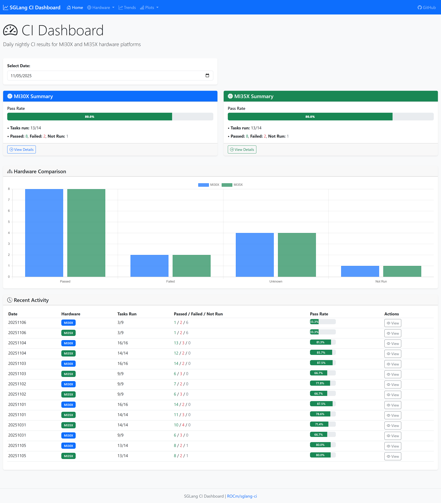
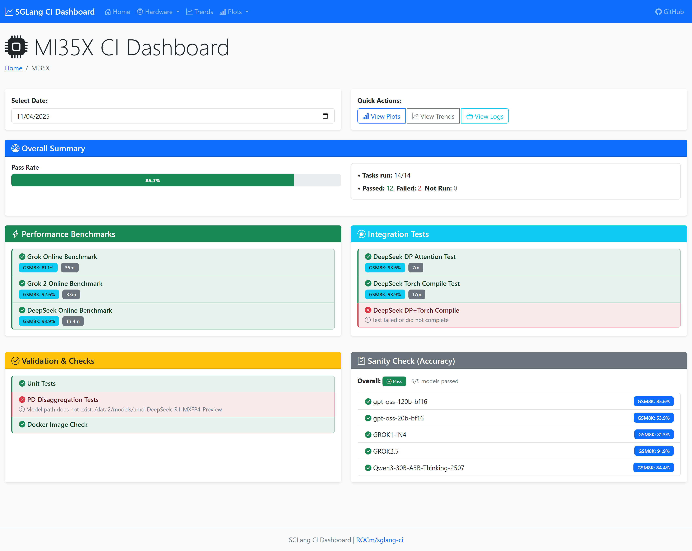

# SGLang CI Data Repository

This repository stores CI logs, plots, and test results from the SGLang CI pipeline.

## 📊 Live Dashboard

**🚀 Interactive CI Dashboard Now Available!**

Access the live dashboard to view and analyze CI results:

```
http://10.194.129.138:5000
```

### Dashboard Features

- **📈 Daily Summaries**: Real-time status for MI30X and MI35X platforms
- **📉 Historical Trends**: Pass rates, GSM8K accuracy, runtime analytics
- **📊 Performance Plots**: Interactive visualization of benchmark results
- **🔍 Task Details**: Detailed status for each CI task
- **⚖️ Hardware Comparison**: Side-by-side comparison of platforms
- **📱 Responsive Design**: Works on desktop, tablet, and mobile

### Quick Links

| Page | URL | Description |
|------|-----|-------------|
| **Home** | http://10.194.129.138:5000/ | Overview of both platforms |
| **MI30X** | http://10.194.129.138:5000/hardware/mi30x | Detailed MI30X results |
| **MI35X** | http://10.194.129.138:5000/hardware/mi35x | Detailed MI35X results |
| **Trends** | http://10.194.129.138:5000/trends | Historical analytics |
| **Plots** | http://10.194.129.138:5000/plots/mi30x | Performance plots |
| **API** | http://10.194.129.138:5000/health | REST API health check |

### Dashboard Pages Preview

#### 1. Home Page
- Summary cards for MI30X and MI35X
- Overall pass/fail statistics
- Pass rate percentages
- Hardware comparison chart
- Recent activity table (last 7 days)

**View**: http://10.194.129.138:5000/?date=20251105

#### 2. Hardware Dashboard (MI30X/MI35X)
- Overall summary statistics
- Performance Benchmarks:
  - Grok Online Benchmark (with GSM8K accuracy)
  - Grok 2 Online Benchmark (with GSM8K accuracy)
  - DeepSeek Online Benchmark (with GSM8K accuracy)
- Integration Tests:
  - DeepSeek DP Attention Test
  - DeepSeek Torch Compile Test
  - DeepSeek DP+Torch Compile
- Validation & Checks:
  - Unit Tests
  - PD Disaggregation Tests
  - Docker Image Check
- Sanity Check (Accuracy):
  - Per-model GSM8K accuracy
  - Pass/fail status with thresholds

**View MI30X**: http://10.194.129.138:5000/hardware/mi30x?date=20251105
**View MI35X**: http://10.194.129.138:5000/hardware/mi35x?date=20251105

#### 3. Trends Page
- Overall pass rate trend (line chart)
- Task status distribution (stacked bar chart)
- GSM8K accuracy trends per benchmark
- Runtime trends comparison
- Configurable time ranges (7, 14, 30, 60, 90 days)

**View**: http://10.194.129.138:5000/trends

#### 4. Plots Viewer
- Performance benchmark plots for each model
- Direct links to GitHub
- Download options
- Image galleries with zoom

**View MI30X Plots**: http://10.194.129.138:5000/plots/mi30x
**View MI35X Plots**: http://10.194.129.138:5000/plots/mi35x

---

## Repository Structure

```
sglang-ci-data/
├── cron_log/              # Cron job execution logs
│   ├── mi30x/
│   │   └── YYYYMMDD/      # Date-organized logs
│   │       ├── grok_nightly.log
│   │       ├── grok2_nightly_online.log
│   │       ├── deepseek_nightly_online.log
│   │       ├── deepseek_dp_attention.log
│   │       ├── deepseek_torch_compile.log
│   │       ├── test_nightly.log
│   │       ├── sanity_check_nightly.log
│   │       └── ...
│   └── mi35x/
│       └── YYYYMMDD/
│
├── plot/                  # Performance benchmark plots
│   ├── mi30x/
│   │   ├── GROK1/online/
│   │   ├── GROK2/online/
│   │   └── DeepSeek-V3-0324/online/
│   └── mi35x/
│       └── ...
│
├── test/                  # Test logs
│   ├── sanity_check_log/
│   │   ├── mi30x/
│   │   └── mi35x/
│   ├── pd/
│   └── unit-test-backend-8-gpu-CAR-amd/
│
└── alert_log/             # Teams alert message history
```

## 🔍 Data Access

### 1. Via Dashboard (Recommended)

Access via the interactive dashboard:
- **URL**: http://10.194.129.138:5000
- **Features**: Search, filter, visualize, compare
- **Authentication**: Automatic (internal network only)

### 2. Via GitHub Web Interface

Browse files directly on GitHub:
- **Logs**: https://github.com/ROCm/sglang-ci/tree/log/cron_log
- **Plots**: https://github.com/ROCm/sglang-ci/tree/log/plot
- **Tests**: https://github.com/ROCm/sglang-ci/tree/log/test

### 3. Via REST API

Programmatic access via dashboard API:

```bash
# Get summary for specific date and hardware
curl http://10.194.129.138:5000/api/summary/mi30x/20251105

# Get historical trends
curl http://10.194.129.138:5000/api/trends/mi30x?days=30

# Get available dates
curl http://10.194.129.138:5000/api/dates/mi30x

# Get plot URLs
curl http://10.194.129.138:5000/api/plots/mi30x/20251105

# Compare hardware
curl http://10.194.129.138:5000/api/compare?date=20251105
```

### 4. Via Git Clone

Clone repository locally:

```bash
git clone -b log https://github.com/ROCm/sglang-ci.git sglang-ci-data
cd sglang-ci-data

# View logs
ls cron_log/mi30x/20251105/

# View plots
ls plot/mi30x/GROK1/online/
```

## 📋 Log Types

### Cron Logs
Daily execution logs from automated CI jobs:
- Performance benchmarks (Grok, Grok2, DeepSeek)
- Integration tests (DP attention, torch compile)
- Validation checks (unit tests, sanity checks)
- Docker image checks

### Performance Plots
Generated PNG charts showing:
- Throughput vs concurrency
- Latency metrics (TTFT, ITL, E2E)
- Historical comparisons
- Multiple configurations

### Test Logs
- **Sanity Check**: Model accuracy validation
- **PD Tests**: Prefix-disaggregation validation
- **Unit Tests**: Backend test suite results

### Alert Logs
Archived Teams notification messages in JSON format.

## 🔄 Update Frequency

- **Logs**: Updated daily after each CI run (~6-8 hours)
- **Plots**: Updated after each benchmark completion
- **Dashboard**: Real-time access to latest data

## 📈 Usage Examples

### View Latest CI Results

Dashboard: http://10.194.129.138:5000/

### Analyze Historical Performance

Dashboard Trends: http://10.194.129.138:5000/trends

### Download Specific Plot

```bash
# Via Dashboard API
curl -o grok_plot.png http://10.194.129.138:5000/github-plots/mi30x/GROK1/online/20251105_GROK1_online_standard.png

# Or via GitHub raw
curl -H "Authorization: token $GITHUB_TOKEN" \
  -o grok_plot.png \
  https://raw.githubusercontent.com/ROCm/sglang-ci/log/plot/mi30x/GROK1/online/20251105_GROK1_online_standard.png
```

### Parse Logs Programmatically

```python
import requests

# Get summary data
response = requests.get('http://10.194.129.138:5000/api/summary/mi30x/20251105')
data = response.json()

print(f"Pass Rate: {data['stats']['passed_tasks']}/{data['stats']['total_tasks']}")
print(f"GSM8K Accuracy: {data['task_results']['Grok Online Benchmark']['gsm8k_accuracy']}")
```

## 🛠️ Maintenance

### Automated Updates

Logs are automatically uploaded via `github_log_upload.sh` script:
- Triggered after each CI job completion
- Uses git rebase to avoid conflicts
- Idempotent (safe to run multiple times)

### Manual Upload

```bash
# Upload specific date logs
cd /mnt/raid/michael/sglang-ci
bash cron/github_log_upload.sh 20251105 mi30x cron

# Upload sanity logs
bash cron/github_log_upload.sh "" mi30x sanity <docker-image-tag>
```

## 📞 Support

For questions or issues:
- **Dashboard Issues**: Check http://10.194.129.138:5000/health
- **Missing Data**: Verify CI jobs ran successfully
- **Plot Problems**: Check `plot/` directory structure

## 📸 Dashboard Screenshots

### Home Page - Daily Summary

*Overview of MI30X and MI35X with pass rates, task counts, and recent activity*

### Hardware Detail Page - MI35X

*Detailed MI35X results showing performance benchmarks, integration tests, validation checks, and sanity check results*

**Note**: For performance plots, visit the live dashboard at http://10.194.129.138:5000/plots/mi30x or http://10.194.129.138:5000/plots/mi35x

## 🔗 Related Resources

- **Main CI Repo**: https://github.com/ROCm/sglang-ci

---

**Last Updated**: November 6, 2025  
**Dashboard Version**: 1.0.0  
**Access**: Internal Network Only
